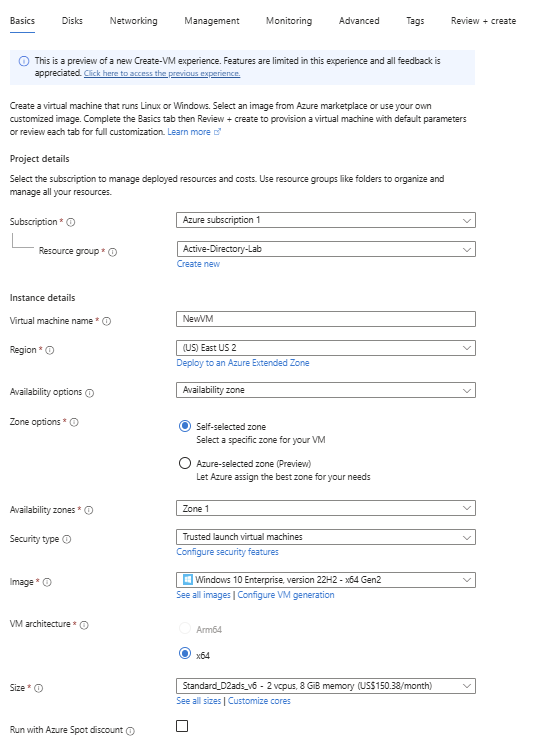
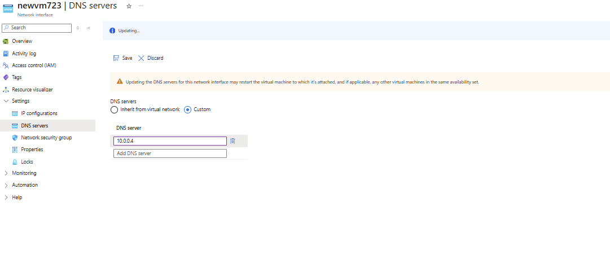
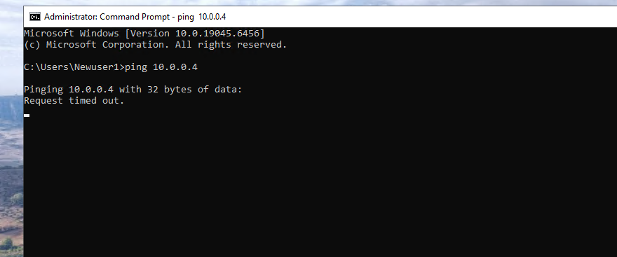
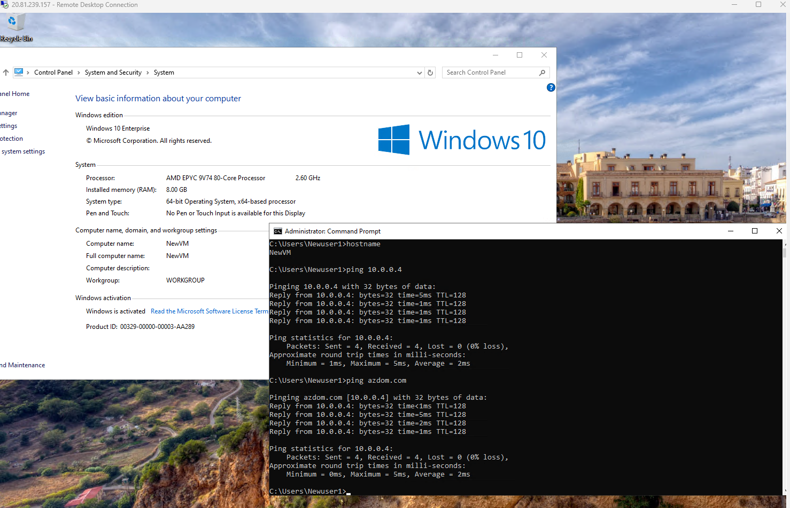
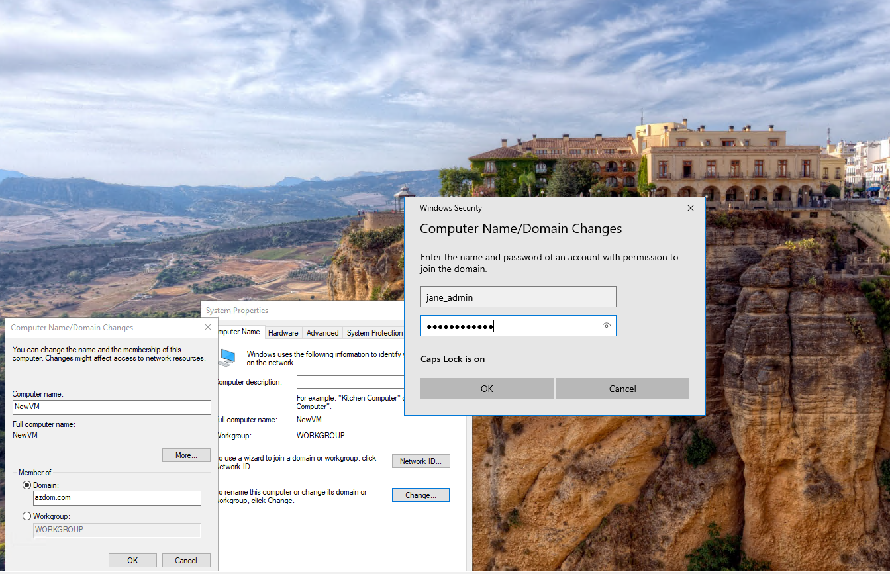
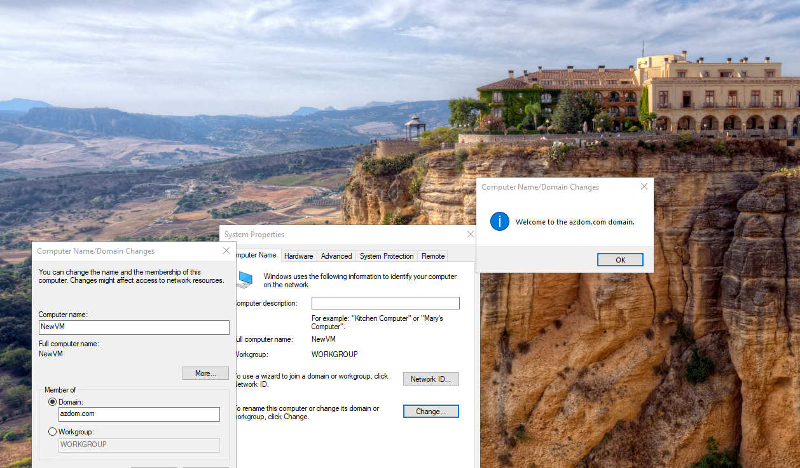
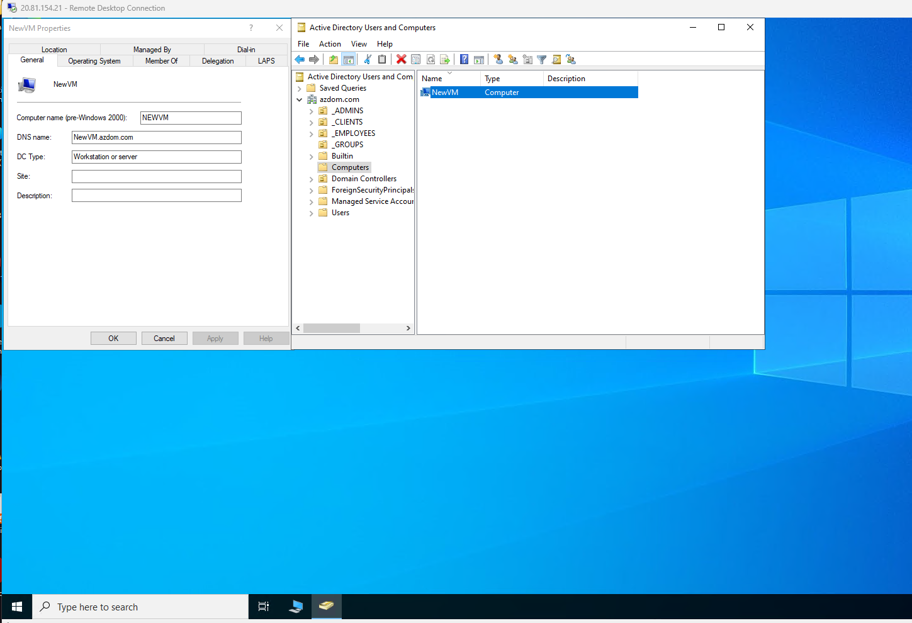
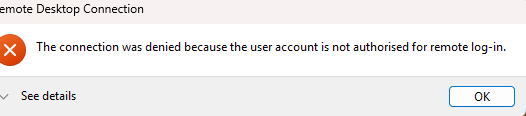
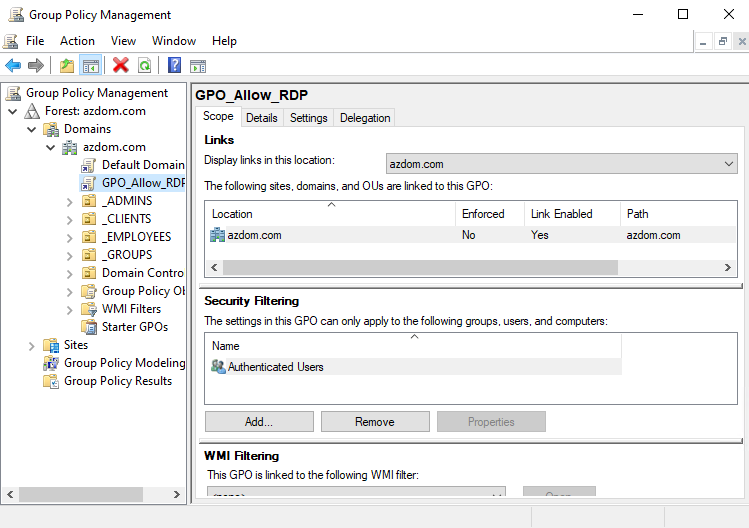
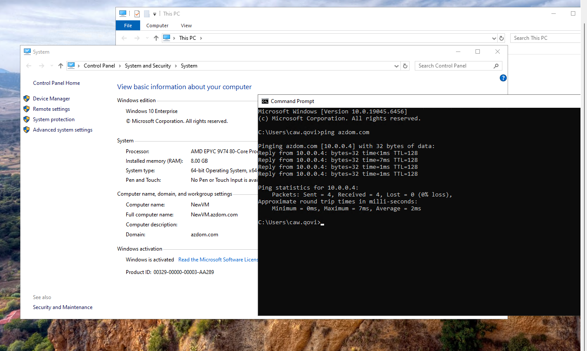

# Azure Cloud Infrastructure and AD: Active Directory Domain Services & Identity Management

## Project Overview
This project involves the end-to-end deployment of a scalable Enterprise Identity Management system within Microsoft Azure. I established a secure Virtual Network (VNet) environment, promoted a Windows Server 2022 instance to a Domain Controller, and integrated a Windows 11 client workstation.

A key focus of this implementation was diagnosing and resolving complex Cloud Networking hurdles, specifically regarding Network Security Group (NSG) rule optimization and Group Policy Object (GPO) configuration for secure remote access.

---

## Technical Stack & Skills
* **Infrastructure:** Azure Virtual Machines (B-series), VNet Architecture, Private IP Static Allocation.
* **Security:** Network Security Group (NSG) Inbound/Outbound Rule Engineering.
* **Identity:** Active Directory Domain Services (AD DS), User/Computer Object Provisioning.
* **Compliance:** Group Policy Management (GPMC) for RDP authorization.
* **Diagnostics:** PowerShell (Test-NetConnection), ICMP Troubleshooting, DNS SRV Record verification.

---

## Implementation & Troubleshooting Journey

### Phase 1: Network Foundation & DNS Bridging
I initiated the lab by configuring the Virtual Network. To ensure reliable domain discovery, I modified the Client VM's Network Interface Card (NIC) settings to utilize the Domain Controller's private IP as the primary DNS resolver.

### Phase 2: Diagnostic Analysis (Identifying the NSG Block)
Initial connectivity tests failed. Despite correct DNS settings, the Client VM was unable to reach the Domain Controller. I utilized ICMP pings to verify that the traffic was being dropped at the Azure firewall level.

### Phase 3: NSG Rule Optimization & Port Handshake
To resolve the connectivity gap, I engineered custom Inbound Security Rules for the Domain Controller's NSG. By explicitly allowing **DNS (53), Kerberos (88), LDAP (389), and SMB (445)**, I established the necessary "handshake" between the endpoints.

### Phase 4: Domain Integration & Security Trust
With a verified network path, I performed the formal Domain Join. I authenticated the session using Domain Administrator credentials, establishing a secure trust relationship between the workstation and `mydomain1.com`.

### Phase 5: Post-Join Verification (ADAC)
I verified the success of the integration by confirming the `Azure12` computer object was correctly registered within the Active Directory Administrative Center (ADAC) on the Domain Controller.

### Phase 6: Resolving RDP Access via Group Policy
A secondary challenge was encountered when the domain user `Caw.Covi` was denied remote access. 

* **The Problem:** Default security postures prevent non-admin domain users from RDP access.
* **The Solution:** I implemented a **Group Policy Object (GPO)** to authorize the "Remote Desktop Users" group for sign-in and forced a policy refresh.

### Phase 7: Final Validation
The project concluded with a successful logon of the `Caw.Covi` domain user on the `Azure12` client machine, confirming that the entire identity and access lifecycle was functional.

---

## Conclusion
This lab demonstrates the ability to manage complex cloud identity environments. Beyond simple setup, it showcases the diagnostic skills required to troubleshoot firewall-level blocks and apply enterprise-grade security policies through AD and GPMC.
*Developed by [Taki] as part of an Advanced Azure Systems aand Active Directory Administration Portfolio.*
